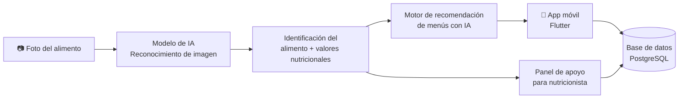

<!-- ========================= -->
<!-- BANNER -->
<!-- ========================= -->

  

  

  
  
  
  

 

<!-- ========================= -->
<!-- ABOUT ME -->
<!-- ========================= -->
## 👋 Sobre mí

Soy **Ingeniero de Software** egresado de la Universidad de las Fuerzas Armadas ESPE, enfocado en **desarrollo móvil** con Flutter y React Native. Me interesa especialmente el punto donde el mobile se cruza con la **inteligencia artificial** — construir apps que no solo se ven bien, sino que integran modelos de IA para resolver un problema real (reconocimiento de imágenes, recomendación, automatización).

También tengo base sólida en desarrollo full stack (Node.js, Laravel, Spring Boot, PostgreSQL), así que puedo moverme por todo el stack cuando el proyecto lo pide.

- 📱 Enfoque principal: **apps móviles con integración de IA**
- 🥗 Actualmente construyendo **DK-Fitt** — control nutricional con reconocimiento de alimentos por foto
- 🎓 Ingeniería de Software — ESPE
- 🧠 Me interesa cómo la IA generativa cambia la forma de construir producto, no solo de programar
- 🤝 Abierto a colaborar en proyectos de mobile + IA

 

<!-- ========================= -->
<!-- ARCHITECTURE DIAGRAM (Mermaid) -->
<!-- ========================= -->
## 🧩 Cómo pienso un sistema: DK-Fitt

En vez de solo listar tecnologías, así es como está estructurado mi proyecto de titulación — una app de control nutricional que reconoce alimentos por foto y recomienda menús con IA:

 

<!-- ========================= -->
<!-- TECH STACK -->
<!-- ========================= -->
## 🛠 Tech Stack

**Mobile** — mi foco principal

  
  
  
  

**Backend & APIs**

  
  
  
  

**Frontend / Web**

  
  
  

**Bases de datos**

  
  
  

**IA · Automatización · Herramientas**

  
  
  
  
  
  

 

<!-- ========================= -->
<!-- FEATURED PROJECTS -->
<!-- ========================= -->
## 📌 Proyectos Destacados

### 🥗 DK-Fitt — Proyecto de Titulación
App móvil de control nutricional con reconocimiento de alimentos por fotografía mediante IA, más un motor de recomendación de menús personalizados que apoya el trabajo de nutricionistas.

`Flutter` `IA / Visión por computador` `Recomendación con IA`

[🔗 Ver repositorio](https://github.com/ravivanco/dk-fitt-mobile)

---

### 🚴 PROWESS BIKE — Proyecto de Vinculación
Módulo móvil para gestión de rutas y bicicletas, desarrollado como parte de un proyecto de vinculación universitaria enfocado en movilidad urbana.

`Flutter` `Android Studio`

[🔒 Repositorio privado — próximamente](https://github.com/ravivanco)

---

### 🍽️ NutriSportiff
App para cálculo del Índice de Masa Corporal (IMC) y generación de recomendaciones alimenticias personalizadas.

`Mobile` `Lógica de recomendación nutricional`

[🔗 Ver repositorio](https://github.com/ravivanco/NutriSportFitt)

---

### 🛵 Delivery App — Kaizen Software
App de delivery con flujos de pedido, seguimiento y gestión de usuarios, desarrollada durante mis prácticas preprofesionales.

`React Native` `Expo` `Android Studio`

[🔒 Repositorio privado — próximamente](https://github.com/ravivanco)

> 💡 *PROWESS BIKE y el delivery app de Kaizen aún no están públicos. En cuanto los subas (o los hagas públicos si son privados), reemplaza esos dos links por la URL directa del repo.*

 

<!-- ========================= -->
<!-- OTHER PROJECTS -->
<!-- ========================= -->
## 🗂️ Otros Proyectos

| Proyecto | Stack | Repo |
|---|---|---|
| **CakeShoop** — tienda online | Laravel / Blade | [Ver](https://github.com/ravivanco/CakeShoop) |
| **Juego2D** — videojuego 2D | C# / Unity | [Ver](https://github.com/ravivanco/Juego2D) |
| **ChatBoot** — chatbot web | HTML/JS | [Ver](https://github.com/ravivanco/ChatBoot) |
| **Software-Seguro** — seguridad de software | PHP | [Ver](https://github.com/ravivanco/Software-Seguro) |

 

<!-- ========================= -->
<!-- GITHUB STATS -->
<!-- ========================= -->
## 📊 GitHub Stats

  
  

  

  

 

<!-- ========================= -->
<!-- CURRENTLY -->
<!-- ========================= -->
## 🌱 En qué estoy ahora

- 🔭 Puliendo **DK-Fitt** para su presentación final
- 📱 Profundizando en arquitectura móvil escalable con Flutter
- 🤖 Explorando cómo integrar modelos de IA de forma más eficiente en apps móviles
- 💼 Abierto a oportunidades como **Desarrollador Móvil**

 

<!-- ========================= -->
<!-- CONTACT -->
<!-- ========================= -->
## 📫 Contacto

  
  
  

  

